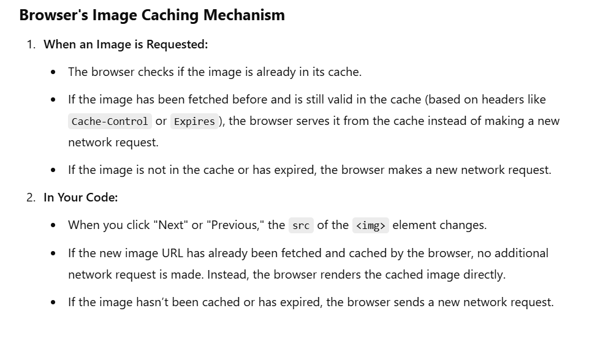
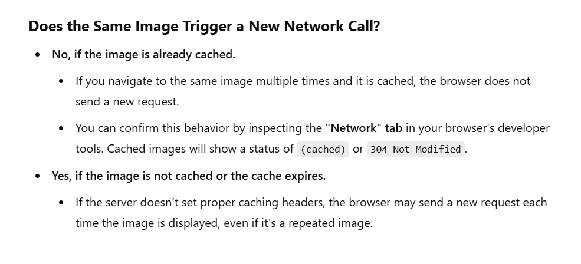

# Image Carousel

1.First gather the list of images in one array or we can get it from API fetch request
2.Created the ImageCarousel component and added the this component in App component.
3.Added the previous and next buttons in page for image carousel
4.handled the functionalities in previous and next button by using state update .

# Issues in this app
    Let’s address the network behavior when clicking "Next" or "Previous" and whether repeated images are fetched from the network:

    refer this image ->   

